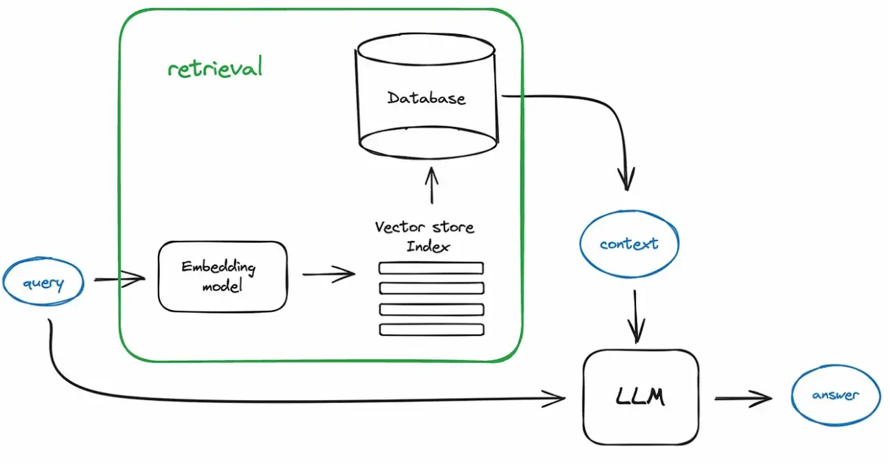

# 필수 구현 과제

- [x] 1. 참고 코드를 참고하여 사용환경을 준비했는가
- [x] 2. 참고 코드를 참고하여 모델을 로드하였는가
- [x] 3. 참고 코드를 참고하여 문서를 로드하였는가
- [x] 4-1. 참고 코드를 참고하여 문서 청킹 방법 2개를 모두 수행했는가
- [x] 4-2. 문서 청킹 방법 2개에 대한 설명을 markdown으로 서술했는가
- [x] 5. 참고 코드를 참고하여 벡터 임베딩을 생성하였는가.
- [x] 6. 참고 코드를 참고하여 벡터 스토어를 생성하였는가.
- [x] 7. 참고 코드를 참고하여 retriever를 생성하였는가. 
- [x] 8. 참고 코드를 참고하여 RAG 체인을 구성하였는가. 
- [x] 9-1. 참고 코드를 정상적으로 실행하여 챗봇이 구동가능하여, 물어본 질문에 잘 답변하는가.
- [x] 9-2. 챗봇 답변 내역을 일반 LLM 답변 내역과 비교하였는가
- [x] 9-3. 왜 RAG 이 필요한지에 대해서 markdown으로 서술했는가

---
#### 1. "초거대 언어모델 연구 동향.pdf" 챗봇
> Characteristics
- Research papers, short sentence units, data containing tables, PDF format, data from the second half of 2023.

> System Requirements 
- Pdf Loader : PyPDFLoader
- LLM : OpenAI (gpt-4o-mini, gpt-3.5-turbo)
- TextSplitter : RecursiveCharacterTextSplitter
- OpenAIEmbeddings : text-embedding-ada-002
- vectorstore : FAISS
- retriever : bm25_retriever + FAISS retriever

---
# 도전 구현 과제

- [x] 1. prompt를 3개 이상 저장하였는가. 
- [x] 2. 외부에 txt로 저장된 프롬프트를 불러와서 정상적으로 실행할 수 있는가. 
- [x] 3. 실행결과가 Result 폴더에 올바른 이름(실험에 쓰인 프롬프트 명시, timestamp 명시)으로 저장되어있는가. 

> System Requirements 
- Prompt1 (Korean prompt) : https://smith.langchain.com/hub/godk/korean-rag
- Prompt2 (question-answer-pair prompt): https://smith.langchain.com/hub/homanp/question-answer-pair
- Prompt3 (hallucination prompt): https://smith.langchain.com/hub/rlm/rag-answer-hallucination