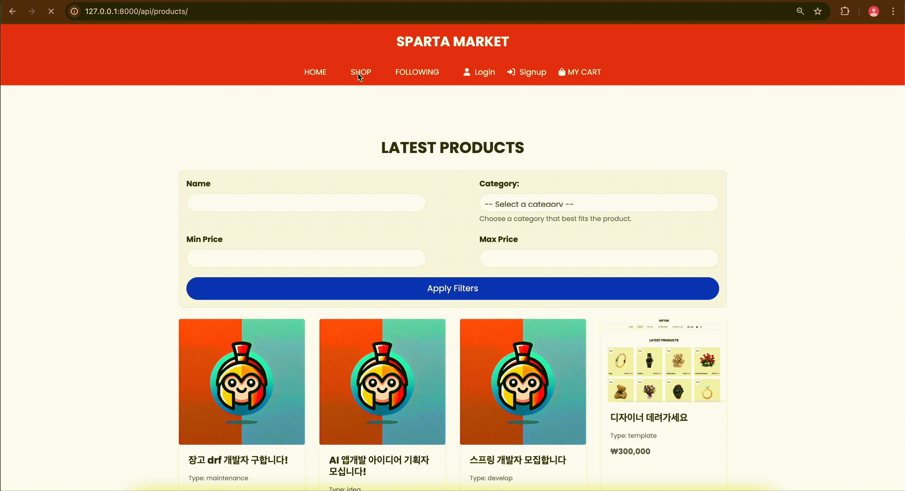
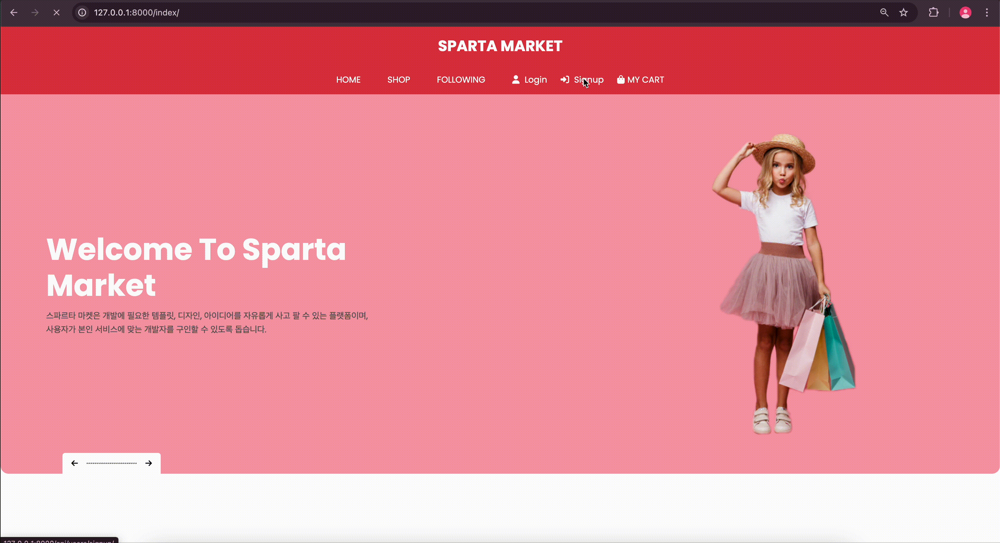
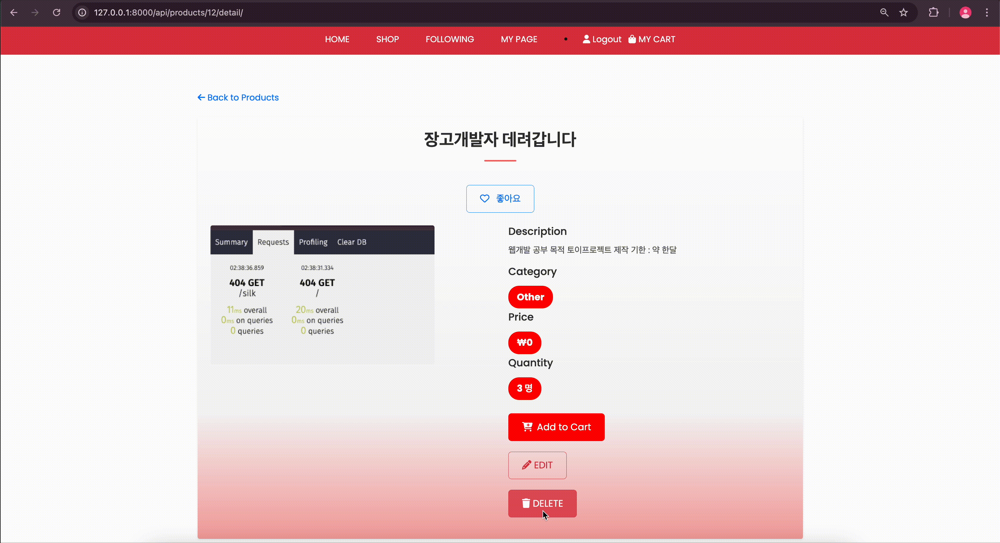
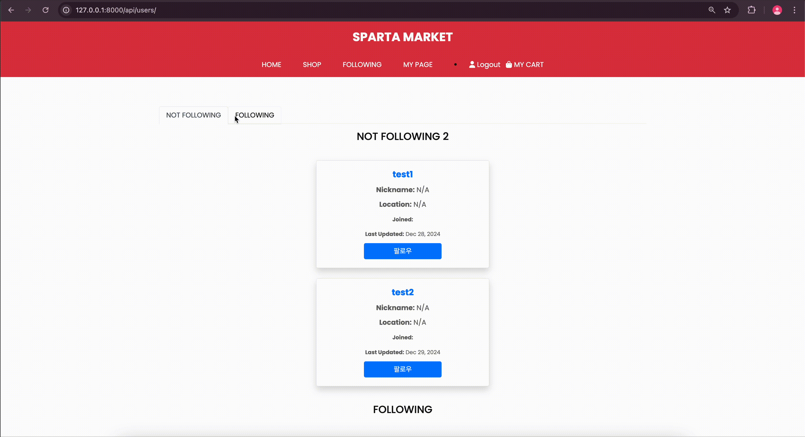
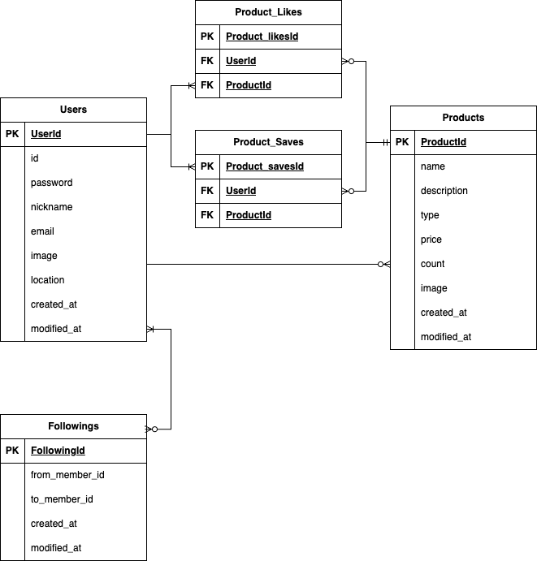

## 📋 Introduction
- 스파르타 마켓은 개발에 필요한 템플릿, 디자인, 아이디어를 자유롭게 사고 팔 수 있는 플랫폼이며,
사용자가 본인 서비스에 맞는 개발자를 구인할 수 있도록 돕습니다.

> 홈




> 회원가입



> 로그인 및 회원정보 수정


> 상품 생성


> 상품 상세


> 상품 삭제



> 팔로잉/언팔로잉




## ERD


---
## 📣 How To Use

```
1. Python version 확인
Python은 3.12 버전 기준

2. 필요한 패키지 설치
pip install -r requirements.txt

3. .env 설정
.env 파일 생성 후 
AWS 키 설정, JWT 초기 Secret key 설정

4. 로컬 구동
python3 manage.py runserver

```

---
## 💻 Applied Technology
- Django
- RestFramework
- JWT
- AWS S3


---
## 🗝️ Key Summary

<details>
<summary>JWT 도입</summary>

```
sessionless 한 JWT를 도입해 불필요한 서버 의존성을 줄였습니다.


"""
코드 부분
"""

load_dotenv()

# SECRET_KEY 환경변수에서 가져오기
SECRET_KEY = os.getenv('SECRET_KEY')

def get_user_id(request):
    access_token = request.COOKIES.get('access', None)
    user_id = None
    if access_token:
        try:
            # access token을 decode하여 user_id 추출
            payload = jwt.decode(access_token, SECRET_KEY, algorithms=['HS256'])
            user_id = payload.get('user_id')
            return user_id
        except jwt.ExpiredSignatureError:
            print("Token has expired.")
            return redirect('users:login')
        except jwt.InvalidTokenError:
            print("Invalid token.")
            return redirect('users:login')
```

</details>

<details>
<summary>DRF 도입 및 전역적 클래스 기반 뷰 도입</summary>

```
Django REST Framework(DRF)를 도입하여 API 서버를 구축하고, 클래스 기반 뷰(Class-Based Views)를 활용하여 코드의 재사용성과 유지보수성을 개선했습니다. DRF를 통해 더 직관적으로 API 설계를 하였으며 Serializer를 통해 데이터를 직렬화하고 역직렬화하는 것을 개선했습니다.
또한, 전역적인 클래스 기반 뷰를 도입하여 공통적인 로직을 중앙에서 관리하고, 중복된 코드 작성을 최소화했습니다. 이를 통해, 각 API 엔드포인트에서 비즈니스 로직을 재사용하고, 유지보수성 높은 구조로 시스템을 관리할 수 있게 되었습니다.

"""
코드 부분
"""

class ProductCreateView(APIView):
    renderer_classes = [TemplateHTMLRenderer]
    template_name = "products/create.html"
    
    def get(self, request):
        
        serializer = ProductListSerializer()

        context = {
            "form": serializer
        }
        return render(request, self.template_name, context)

```

</details>

<details>
<summary>이미지 업로드 S3 연결</summary>

```
Amazon S3를 이용하여 이미지 업로드 기능을 연결했습니다.
이 방식은 서버의 로컬 파일 시스템에 의존하지 않고, 클라우드 기반의 저장소에 이미지를 안전하게 보관할 수 있게 해줍니다. 또한, 이미지 파일의 처리 및 관리가 외부 시스템에 맡겨지므로, 애플리케이션의 성능과 안정성을 높일 수 있습니다.


"""
코드 부분
"""

 try:
                    # S3 버킷에 이미지 업로드
                    s3 = boto3.client(
                        's3',
                        aws_access_key_id=settings.AWS_ACCESS_KEY_ID,
                        aws_secret_access_key=settings.AWS_SECRET_ACCESS_KEY,
                    )
                    bucket_name = settings.AWS_STORAGE_BUCKET_NAME
                    s3_file_name = f'products/{profile_image.name}'
                    s3.upload_fileobj(profile_image, bucket_name, s3_file_name)

                    # S3에 업로드된 파일의 URL 가져오기
                    profile_image_url = f"https://{bucket_name}.s3.{settings.AWS_DEFAULT_REGION}.amazonaws.com/{s3_file_name}"

                    # Product 객체의 이미지 필드 업데이트
                    product.image = profile_image_url
                    print(product.image)

                except (BotoCoreError, NoCredentialsError) as e:
                    return JsonResponse({"error": f"Error uploading to S3: {str(e)}"}, status=500)
```

</details>

<details>
<summary>HTML PUT, DELETE 전송 못합 이슈</summary>

```
HTML에서 PUT 및 DELETE 요청을 전송하는 문제 해결: HTML 폼은 기본적으로 GET과 POST 요청만을 지원합니다. PUT이나 DELETE 요청을 보내려면 HTTP 메서드 오버라이딩 기법을 사용해야 합니다. 이를 위해 POST 요청에서 '_method' 파라미터를 이용하여 실제 PUT 요청을 처리하도록 구현했습니다.

POST 요청으로 받은 '_method' 파라미터 값이 PUT일 경우 put() 메서드를 호출하여 PUT 요청을 처리하도록 하였습니다. 이를 통해 HTML에서 직접 PUT을 보낼 수 없는 문제를 해결하였습니다.

"""
코드 부분
"""

def post(self, request, *args, **kwargs):  # *args와 **kwargs를 추가
        product_id = self.kwargs.get("product_id")  # kwargs에서 product_id 가져오기
        product = get_object_or_404(Product, pk=product_id)  # 안전한 조회를 위해 get_object_or_404 사용

        # HTML에서 PUT 요청을 전송하기 위해 _method를 사용
        if request.POST.get('_method') == 'PUT':
            return self.put(request, *args, **kwargs)

        return HttpResponseNotAllowed(['PUT'])
    
    def put(self, request, *args, **kwargs):  # *args와 **kwargs를 추가
        product_id = self.kwargs.get("product_id")  # kwargs에서 product_id 가져오기
        product = get_object_or_404(Product, pk=product_id)  # 안전한 조회를 위해 get_object_or_404 사용

        data = request.data
        profile_image = request.FILES.get('image')  # 업로드된 이미지를 받음

        if profile_image:
            try:
                # S3 버킷에 이미지 업로드
                s3 = boto3.client(
                    's3',
                    aws_access_key_id=settings.AWS_ACCESS_KEY_ID,
                    aws_secret_access_key=settings.AWS_SECRET_ACCESS_KEY,
                )
                bucket_name = settings.AWS_STORAGE_BUCKET_NAME
                s3_file_name = f'users/{profile_image.name}'
                s3.upload_fileobj(profile_image, bucket_name, s3_file_name)

                # S3에 업로드된 파일의 URL 가져오기
                profile_image_url = f"https://{bucket_name}.s3.{settings.AWS_DEFAULT_REGION}.amazonaws.com/{s3_file_name}"

                # 모델의 이미지 URL 업데이트
                product.image = profile_image_url

            except (BotoCoreError, NoCredentialsError) as e:
                return JsonResponse({"error": f"Error uploading to S3: {str(e)}"}, status=500)

        serializer = ProductDetailSerializer(product, data=data, partial=True)
        if serializer.is_valid(raise_exception=True):
            serializer.save()
            return redirect("products:detail", product_id=product.id)

        return render(request, self.template_name, {"product": product, "form": serializer.errors})

```

</details>