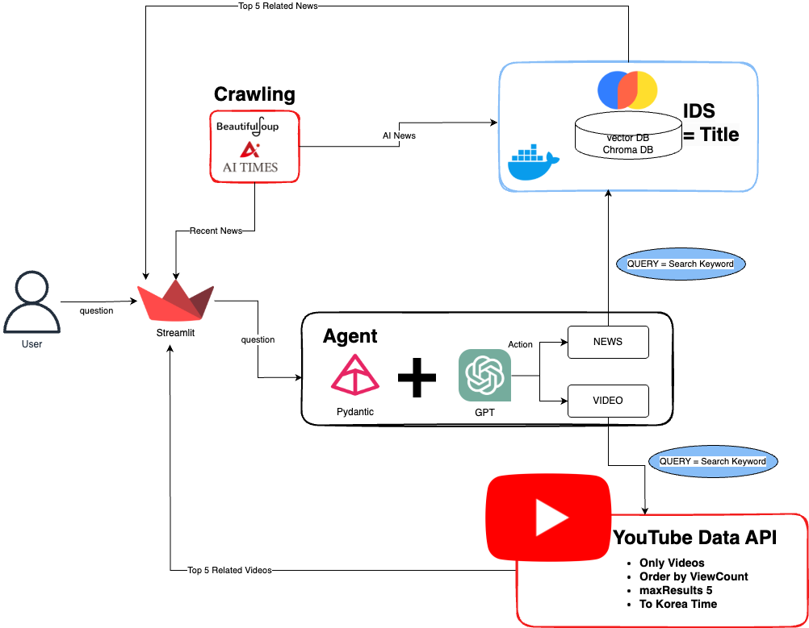
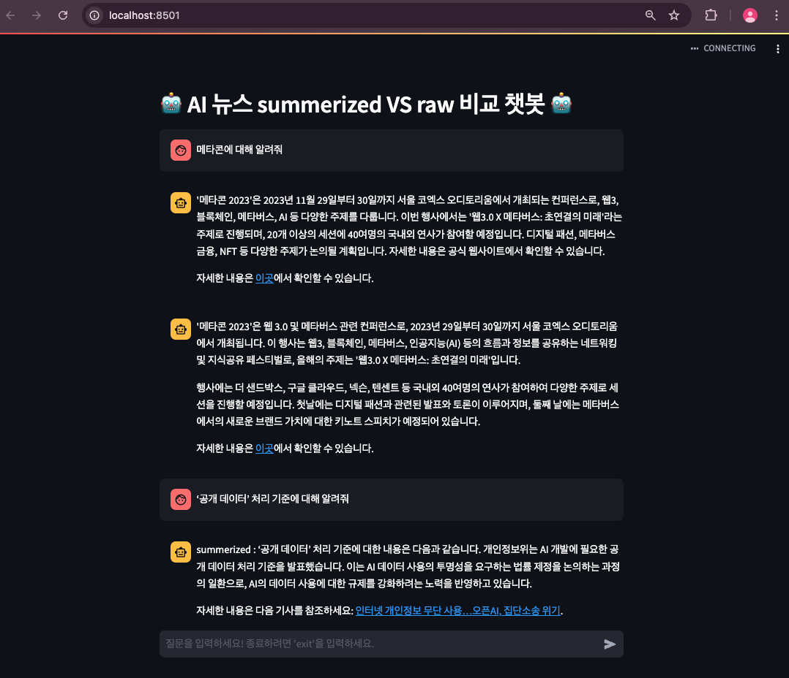
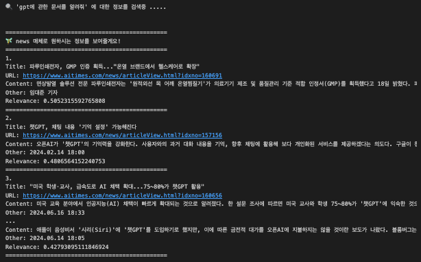

## 📋 Introduction
- 사용자의 AI 관련 질문을 관련 뉴스나 Youtube 영상 제공으로 정보의 확장을 도와주는 Chatbot


## Software Architecture


---
## 📣 How To Use

```
1. Python version 확인
Python은 3.12 버전 기준

2. 필요한 패키지 설치
pip install -r requirements.txt

3. Docker 이미지를 pull하고 pull 한 이미지를 바탕으로 생성된 container를 실행
docker pull chromadb/chroma
docker run -p 9000:8000 chromadb/chrom

4. .env 설정
.env 파일 생성 후 
발급 받은 OPEN_AI_KEY, YOUTUBE_API_KEY 키 input

4. 로컬 구동
streamlit run fe.py

```

---
## 💻 Applied Technology
- Pandas 
- BeautifulSoup
- chromadb
- langchain
- pydantic
- streamlit

> API
- openAI
- youtubeAPI

---
## 🗝️ Key Summary

- [X] 뉴스 데이터 정적 크롤링
- [X] 요약된 뉴스 본문과 요약되지 않은 뉴스 본문 비교
- [X] Streamlit 이용한 UI 확인
- [X] 임베딩돤 뉴스 데이터 vectorDB 저장을 위한 Chroma DB Docker 도입
- [X] 사용자의 입력값에 따른 Agent활용 매체 선택 분류 기능, 입력값에서 실질적인 keyward 추출 기능 적용
- [X] Youtube API를 이용한 관련 영상 가져오는 기능 도입
- [X] Streamlit 2차 연결
- [X] SA 작성

<details>
<summary>Vector DB</summary>

```
# vectorDB로 ChromaDB 선택한 이유
- HNSW (Hierarchical Navigable Small World) 알고리즘을 활용해 대규모 벡터 데이터를 빠르게 처리하며 확장성이 좋기 때문입니다.

# ids로 뉴스의 타이틀을 선택한 이유
- 뉴스 특성상 본문의 내용을 요약하고 있는 문장이 뉴스 제목임을 생각했습니다.
- DB에서 제목을 직접 조회함으로 검색 속도를 높일 수 있을 것이라 판단했습니다.
```

</details>

<details>
<summary>Agent (Pydantic)</summary>

```

# Agent 도입 이유 
- 프롬프트는 사람이 작성한 규칙이므로 AI가 잘못된 출력 포맷을 생성하거나 규칙을 지키지 못할 가능성이 있습니다.
- 때문에 Pydantic 모델을 통해 출력된 데이터를 구조적으로 검증하여 예상치 못한 오류를 방지할 수 있습니다.
- Agent 도입을 통해 사용자의 입력 값에 따른 LLM만으로는 해결하지 못했던 본 서비스가 제공하는 AI관련 질문 외의 입력값에 따른 자동화된 에러 핸들링을 하게 되었습니다.


# LLM에 보내질 프롬프트에 format_instructions를 제한
- action, action_input, search_keyword

# action
- range를 video, news, not_supported로 제한

# action_input
- 사용자의 질의는 1글자 이상으로 제한

# search_keyword
- 검색에 사용할 최적화된 키워드

```

</details>


---
## 🎢 Timeline

### 1. AI News Crawling

> 2024/11/20
- 10,000 articles (2023/07/20 ~ 2024/11/20)
- including title, created_at, content -> json
- original site : https://www.aitimes.com/news/articleList.html


### 2. Create News Summarization
> 2024/11/21
- 100 articles (random)
- LLM : openAI chat-gpt-4o-mini
- embedding : text-embedding-ada-002

### 3. Create News Rag & Chatbot
> 2024/11/26
- Two rag chain (raw, summarized)
- BE : be.py
- FE : streamlit (fe.py)
- Find middle text hole

How To Use :
`streamlit run fe.py`

Test Screen : 




### 4. Create Youtube Agent
> 2024/12/10
- create vectorDB : embedding.ipynb
- agent : agent.ipynb

How To Use :
`Turn on the Chroma Docker & Go to agent.ipynb`

Test Screen :



---

